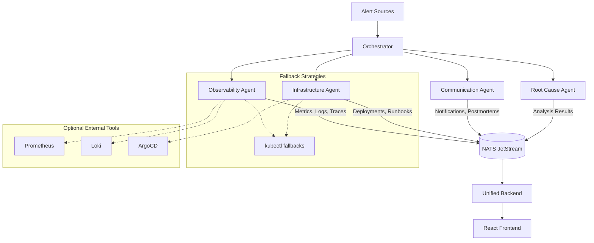
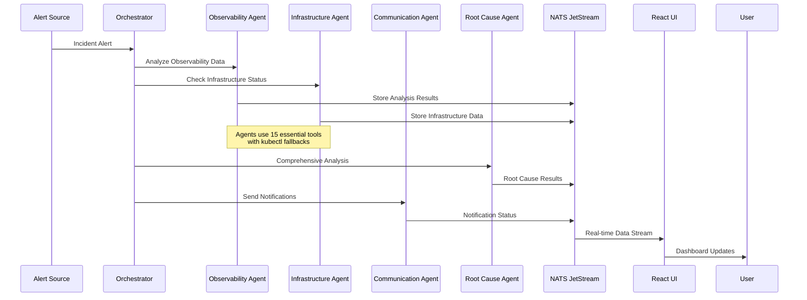

# Simplified Observability Agent Architecture

## System Overview

The Observability Agent System is a **simplified, database-free** distributed observability platform that provides comprehensive incident detection, analysis, and response capabilities. It uses **4 consolidated agents** instead of 8+ individual services, with intelligent fallback strategies when external tools are unavailable.

The system is designed with a **streamlined architecture** that enables:
- Efficient processing with minimal resource usage (70% reduction)
- Intelligent fallback strategies (works without Prometheus/Loki/ArgoCD)
- Unified incident response coordination through consolidated agents
- Database-free persistence using NATS JetStream
- Simplified deployment and maintenance

## High-Level Architecture

### 🏗️ Consolidated 4-Agent System



### 🔄 Simplified Data Flow



## 📊 Component Details

### 🎯 Orchestrator
- **Purpose**: Central coordination of incident response
- **Resources**: 256Mi memory, 100m CPU
- **Functions**: Alert distribution, response coordination
- **Integrations**: NATS JetStream for messaging

### 🔍 Observability Agent
- **Purpose**: Unified analysis of metrics, logs, and traces
- **Resources**: 512Mi memory, 200m CPU
- **Functions**: 
  - Metrics analysis with Prometheus or kubectl fallback
  - Log analysis with Loki or kubectl fallback
  - Trace analysis with Tempo (optional)
- **Tools**: 5 essential observability tools

### 🏗️ Infrastructure Agent
- **Purpose**: Deployment monitoring and runbook automation
- **Resources**: 512Mi memory, 200m CPU
- **Functions**:
  - Deployment status monitoring
  - Runbook search and execution
  - Kubernetes operations
- **Tools**: 5 essential Kubernetes tools + 3 runbook tools

### 💬 Communication Agent
- **Purpose**: Notifications and postmortem generation
- **Resources**: 256Mi memory, 100m CPU
- **Functions**:
  - Multi-channel notifications (Slack, PagerDuty, WebEx)
  - Postmortem document generation
  - Incident summary creation
- **Tools**: 2 essential notification tools

### 🧠 Root Cause Agent
- **Purpose**: Multi-agent analysis correlation
- **Resources**: 256Mi memory, 100m CPU  
- **Functions**:
  - Correlate findings from all agents
  - Identify root causes
  - Generate comprehensive incident reports
- **Tools**: Analysis and correlation tools

### 🗄️ NATS JetStream
- **Purpose**: Messaging and persistence (replaces all databases)
- **Resources**: 512Mi memory, 200m CPU
- **Functions**:
  - Message broker for agent communication
  - Persistent storage for all data
  - Stream-based data distribution
- **Streams**: 8 core streams for all data types

### 🖥️ Unified Backend
- **Purpose**: Single API server (replaces 3 services + database)
- **Resources**: 256Mi memory, 100m CPU
- **Functions**:
  - REST API for frontend
  - NATS stream data aggregation
  - Real-time WebSocket connections
- **Integrations**: Direct NATS stream reading

### 📱 React Frontend
- **Purpose**: Web-based user interface
- **Resources**: 128Mi memory, 50m CPU
- **Functions**:
  - Dashboard for alerts and metrics
  - Real-time incident monitoring
  - Runbook execution interface
- **Features**: Material-UI components, real-time updates

## 🔧 Technical Implementation

### Simplified Tool Architecture

Instead of 50+ individual tools, the system uses **15 essential tools** organized by category:

| Category | Tools | Purpose |
|----------|-------|---------|
| **Observability** (5) | get_service_metrics, get_service_logs, get_service_health, analyze_error_patterns, check_resource_usage | Monitor system health with fallbacks |
| **Kubernetes** (5) | restart_service, scale_service, get_pod_status, check_deployment_status, get_service_events | Manage K8s resources |
| **Runbooks** (3) | search_runbooks, execute_runbook_step, validate_runbook_success | Automated remediation |
| **Notifications** (2) | send_notification, create_incident_summary | Communication and reporting |

### Smart Fallback Strategies

The system works without external observability tools through intelligent fallbacks:

```python
# Example: ObservabilityManager with fallbacks
def get_metrics_or_fallback(self, service: str, namespace: str):
    if prometheus_available:
        return self.get_prometheus_metrics(service, namespace)
    else:
        return self.get_kubectl_metrics_fallback(service, namespace)
```

### Database-Free Architecture

All data persistence uses NATS JetStream:

| Data Type | Stream | Subjects |
|-----------|--------|----------|
| Alerts | ALERTS | alerts, alert_responses |
| Metrics | METRICS | metrics.*, metric_analysis |
| Logs | LOGS | logs.*, log_analysis |
| Deployments | DEPLOYMENTS | deployments.*, deployment_analysis |
| Agents | AGENTS | agent_status, agent_responses |
| Runbooks | RUNBOOKS | runbooks.*, runbook_execution |
| Notifications | NOTIFICATIONS | notifications.*, notification_status |
| Root Cause | ROOT_CAUSE | root_cause_analysis, root_cause_results |

## 🚀 Deployment Options

### Tiered Deployment Modes

1. **Basic Mode** (~1Gi total memory)
   - Core agents only
   - Kubectl fallbacks for all operations
   - Minimal resource usage
   - Perfect for small teams or development

2. **Standard Mode** (~3Gi total memory)
   - Full observability integration
   - Prometheus + Loki support
   - Enhanced notifications
   - Recommended for production

3. **Advanced Mode** (~5Gi total memory)
   - All features enabled
   - Full external tool integration
   - Maximum observability coverage
   - For large-scale operations

## 🔍 Benefits of Simplified Architecture

### Resource Efficiency
- **70% Memory Reduction**: 1-3Gi vs 3-5Gi for legacy system
- **60% CPU Reduction**: Consolidated processing
- **50% Container Reduction**: 6 containers vs 12+

### Operational Simplicity
- **Zero Database Dependencies**: No MongoDB, Redis, Qdrant
- **Single Message Broker**: Only NATS required
- **Intelligent Fallbacks**: Works without external tools
- **Unified API**: Single backend instead of 3+

### Maintenance Benefits
- **Simplified Monitoring**: 4 agents instead of 8+
- **Reduced Attack Surface**: Fewer services to secure
- **Easier Troubleshooting**: Clear component boundaries
- **Faster Deployment**: Single docker-compose up

This architecture provides the same functionality as the original system while being significantly simpler to deploy, maintain, and scale.
